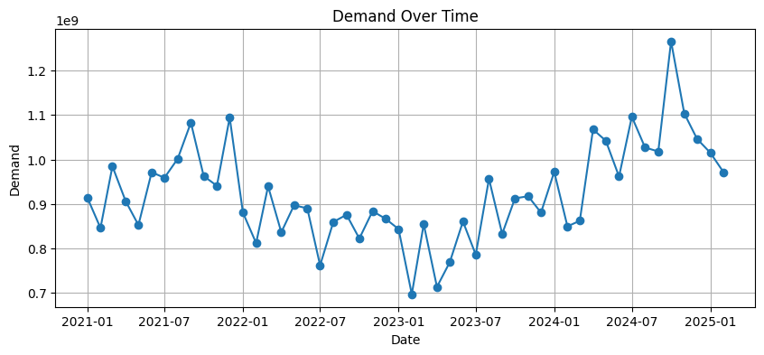
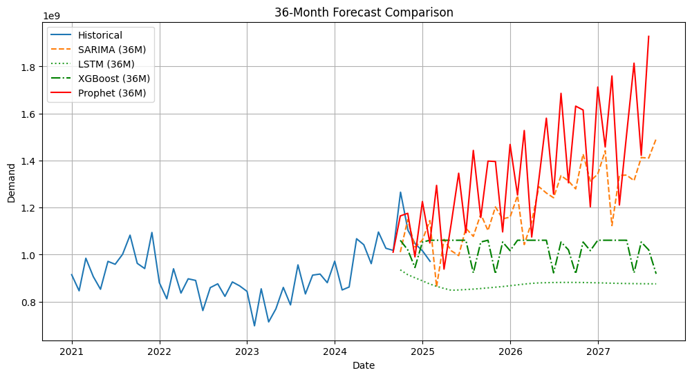

# Demand Forecasting

This repository demonstrates **time series forecasting** using four different models: **SARIMA**, **LSTM**, **XGBoost**, and **Prophet**. The goal is to predict **future demand** over a 36-month horizon, with the **last 6 months** held out as a test set.

---

## 1. Project Structure

```
.
├── notebook.ipynb          # Jupyter Notebook with all the code
├── requirements.txt        # Python dependencies
├── README.md               # This file
├── raw_data.png            # Raw data time series plot
├── forecast_compare.png    # Comparison of forecasts
├── data.parquet            # Dataset
└── data.csv                # Dataset in csv
```

- **`data.csv`**: The raw dataset containing dates and demand values.
- **`notebook.ipynb`**: All preprocessing, model training, evaluation, and plotting code.
- **`requirements.txt`**: Contains all the necessary libraries to run the notebook.
---

## 2. Requirements

All dependencies are listed in **`requirements.txt`**. To install them:

```bash
pip install -r requirements.txt
```

## 3. How to Run

1. **Clone or Download** this repository.
2. **Install Dependencies**:
   ```bash
   pip install -r requirements.txt
   ```
3. **Open** the `notebook.ipynb` in Jupyter Notebook, JupyterLab, or VSCode.
4. **Run** the notebook cells sequentially:
   - Data **loading** and **preprocessing**  
   - **Model training** (SARIMA, LSTM, XGBoost, Prophet)  
   - **Evaluation** on the last 6 months  
   - **Forecasting** for the next 36 months  
   - **Visualization** of forecasts vs. actual

---

## 4. Methodology

1. **Data Aggregation**: We group the data by month (if needed) and handle missing values or outliers.  
2. **Train-Test Split**: The final 6 months of data are reserved for out-of-sample testing.  
3. **Models**:
   - **SARIMA**: A classical time series model that handles seasonality via differencing and seasonal terms.  
   - **LSTM**: A neural network model for sequential data, capturing long-term dependencies.  
   - **XGBoost**: A tree-based ensemble method using lag features for univariate time series.  
   - **Prophet**: A decomposable forecasting model from Facebook, suited for seasonality and trend.  
4. **Evaluation**:  
   - **RMSE** (Root Mean Squared Error)  
   - **MAE** (Mean Absolute Error)  
   - **MAPE** (Mean Absolute Percentage Error)  

---

## 5. Results

**Last 6 Months (Test Set) Performance:**

```
SARIMA  => RMSE=88,946,160.38,  MAE=74,753,966.01,  MAPE=6.97%
LSTM    => RMSE=162,355,513.39, MAE=125,436,174.67, MAPE=11.02%
XGBoost => RMSE=111,201,885.71, MAE=86,429,368.00,  MAPE=7.85%
Prophet => RMSE=107,202,705.00, MAE=87,513,219.18,  MAPE=NaN%
```

- **SARIMA** achieved the **lowest RMSE** (~88.9M) and the lowest MAPE (~7%), making it the top performer among these four models for the final test period.  
- **XGBoost** also performed well, with ~111M RMSE and ~7.85% MAPE.  
- **LSTM** had higher RMSE (~162M) and ~11% MAPE, indicating room for improvement.  
- **Prophet** gave a decent RMSE (~107M), but MAPE is `NaN` due to zero or near-zero values in the test set.

---

## 6. Visualizations

**Raw Data Plot**  
Shows the monthly demand trends and seasonality over the original dataset.



**Forecast Comparison**  
Displays the 36-month forecast from all four models, plotted against the historical data.



---

## 7. Next Steps

1. **Hyperparameter Tuning**: Increase the search space for XGBoost and LSTM parameters, and consider a more robust approach for Prophet.  
2. **Feature Engineering**: Incorporate external variables (e.g., holidays, promotions, macroeconomic data) to improve accuracy.  
3. **Rolling Window Validation**: Evaluate model performance across multiple rolling splits for more robust results.  
4. **Log Transform**: Experiment with `log1p` transforms if the data scale is large or exhibits high variance.  